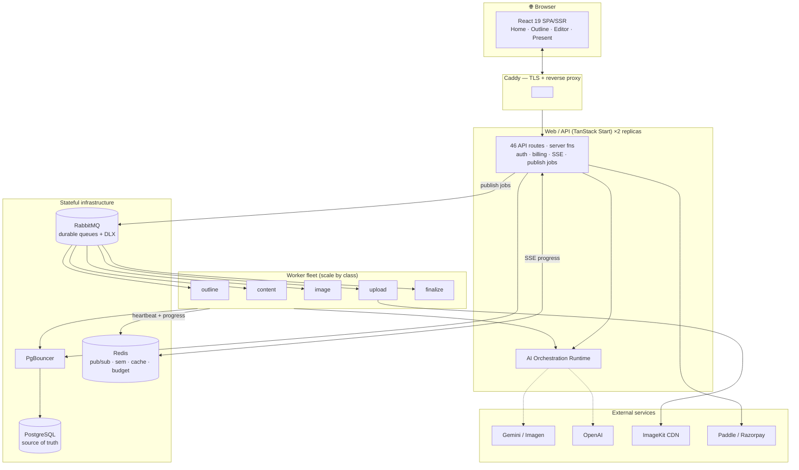
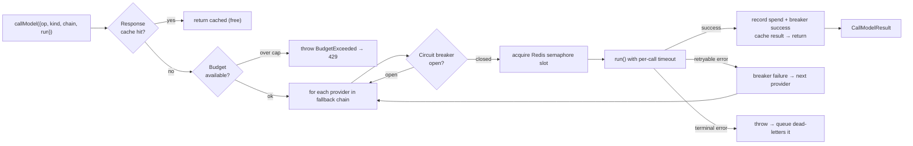
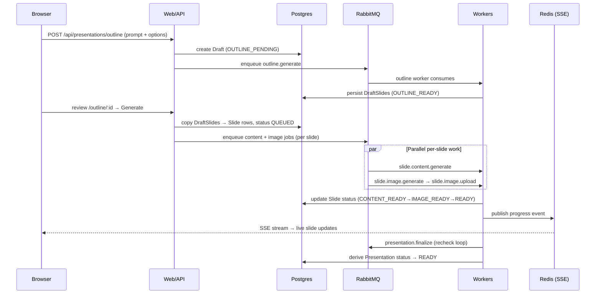
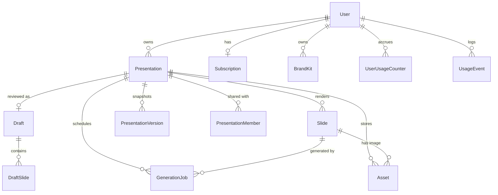

<div align="center">

# Kodexa — AI Presentation Platform

**Type a prompt. Get a designed, editable, exportable slide deck.**

An end-to-end, production-grade SaaS that turns a single sentence into a fully art-directed presentation — generated asynchronously by a fleet of workers, styled by an adaptive layout engine, refined by an in-app AI agent, and billed through a real subscription system.

`TanStack Start` · `React 19` · `Prisma 7 / Postgres` · `RabbitMQ` · `Redis` · `Gemini + Imagen` · `OpenAI` · `Better Auth` · `Paddle` · `Docker` · `Caddy` · `Prometheus + Grafana`

</div>

---

## Table of Contents

1. [Why this project matters](#1--why-this-project-matters)
2. [What it does](#2--what-it-does)
3. [Technology stack](#3--technology-stack)
4. [System architecture](#4--system-architecture)
5. [The AI orchestration runtime](#5--the-ai-orchestration-runtime-the-crown-jewel)
6. [The asynchronous generation pipeline](#6--the-asynchronous-generation-pipeline)
7. [Adaptive layout engine](#7--adaptive-layout-engine)
8. [The deck-level AI agent](#8--the-deck-level-ai-agent)
9. [Templating & theming](#9--templating--theming)
10. [Data model](#10--data-model)
11. [Billing, entitlements & quotas](#11--billing-entitlements--quotas)
12. [Security posture](#12--security-posture)
13. [Observability & operations](#13--observability--operations)
14. [Repository layout](#14--repository-layout)
15. [Getting started](#15--getting-started)
16. [Configuration](#16--configuration)
17. [Testing & quality](#17--testing--quality)
18. [Roadmap](#18--roadmap)

---

## 1 · Why this project matters

Most "AI slide generator" demos are a thin wrapper around one `chat.completions` call that streams markdown into a `<div>`. This is **not** that.

Kodexa is a full attempt to build a **Gamma-class product** with the engineering rigor of a real SaaS — the kind of system you can point 200–500 paying users at and not get paged at 3 a.m. It treats AI generation as what it actually is in production: **slow, expensive, rate-limited, and occasionally failing** — and engineers around every one of those realities.

What makes it worth studying:

- **AI is treated as untrusted infrastructure.** Every model call flows through a single orchestration runtime with a response cache, per-provider circuit breakers, a cluster-wide concurrency limiter, per-call timeouts, automatic multi-provider fallback, and a **hard daily spend kill-switch** — so a bad prompt or a provider outage degrades gracefully instead of melting your bill.
- **Generation is decoupled from the request.** A prompt doesn't block an HTTP handler for 90 seconds. It becomes a set of durable, idempotent jobs on RabbitMQ, processed by horizontally-scalable workers, with progress streamed back to the browser over Server-Sent Events.
- **It's a real business, not a toy.** Subscription billing through a Merchant-of-Record (Paddle), plan-based feature gates, monthly usage quotas, collaboration/sharing, PPTX export, and a legal/pricing surface are all wired in.
- **It's operable.** Prometheus metrics, Grafana dashboards, alert rules, Sentry error tracking, structured logs, health probes per worker class, nightly Postgres backups, and a documented VPS deploy topology behind Caddy with automatic HTTPS.

In short: it's a portfolio piece that reads like a system-design interview answer, implemented.

---

## 2 · What it does

| Capability | Description |
|---|---|
| **Prompt → outline** | A prompt plus knobs (audience, tone, length, depth, language, image style, template) produces an **editable outline draft** you review before committing to full generation. |
| **Async deck generation** | On "Generate," each slide fans out into parallel content + image jobs. Slides light up live as they complete. |
| **AI imagery** | Per-slide images generated via **Imagen / Gemini** (or OpenAI images), uploaded to **ImageKit** CDN, and attached to the slide. |
| **Adaptive auto-layout** | A deterministic engine picks the most "designed" layout per slide from its actual content (bullet density, image, data, cover/closing position) across 10 layout variants. |
| **Deck AI Assistant** | A bounded tool-calling agent that edits the whole deck on command — add/edit/delete/reorder slides, restyle the template — in plain English. |
| **Per-slide assistant** | Chat, one-click text transforms (shorter / more formal / add a statistic), regenerate content or image, and **Visualize** (turn bullets into charts/tables/timelines — a Pro feature). |
| **Templates & brand kits** | 8 professionally-designed templates, live theme customization, and reusable per-user brand kits (colors, type, logo). |
| **Collaboration & sharing** | Invite editors/viewers, public share links with tokens, and version history with restore. |
| **Export** | Download a real `.pptx` (via `pptxgenjs`) with theme colors, speaker notes, and imagery baked in. |
| **Import** | Seed a deck from an existing source document (incl. PDF parsing). |
| **Billing** | Free vs Pro subscription (Paddle), plus per-deck one-off payments in INR (Razorpay). |

---

## 3 · Technology stack

**Framework & UI**
- [TanStack Start](https://tanstack.com/start) — full-stack React framework with SSR, file-based routing, and server functions (the single web + API orchestrator).
- **React 19**, TanStack Router + Query, Tailwind CSS v4, Radix UI / shadcn (55 UI primitives), Framer Motion, `next-themes`.

**Backend & data**
- **Prisma 7** ORM over **PostgreSQL** (Neon in dev; Postgres + PgBouncer in prod), using the `@prisma/adapter-pg` driver adapter.
- **RabbitMQ** — durable job transport with dead-letter + retry topology.
- **Redis** — SSE pub/sub, the distributed AI concurrency semaphore, circuit-breaker state, response cache, budget counters, rate limiting, and worker heartbeats.

**AI & media**
- **Google Gemini** (text) + **Imagen** (images) as primary provider; **OpenAI** (`gpt-4.1-mini`, `gpt-image-1`) as fallback and as the deck-agent's function-calling brain.
- **ImageKit** — image storage + CDN delivery.
- `pptxgenjs` (export), `pdf-parse` (import).

**Auth, billing, ops**
- **Better Auth** — email/password + GitHub & Google OAuth, with a strict account-linking policy.
- **Paddle** (subscriptions, Merchant of Record) + **Razorpay** (INR one-off deck payments).
- **Caddy** (reverse proxy + automatic HTTPS), **Docker Compose** (dev + prod stacks), **Prometheus + Grafana** (metrics/dashboards/alerts), **Sentry** (errors), **pino** (structured logs).

**Language & tooling**
- **TypeScript** end-to-end, **Zod** validation, **Vitest** tests, ESLint + Prettier, `tsx` for the worker runtime.

---

## 4 · System architecture

Kodexa uses a deliberately simple, horizontally-scalable topology: **one web/API orchestrator** and **N worker processes**, glued together by durable queues, a shared Postgres source-of-truth, and Redis for real-time signaling. This keeps slow, failure-prone AI work off the request path while keeping the auth/session model untouched.



**Runtime components**

| Service | Responsibility |
|---|---|
| `caddy` | Automatic HTTPS + reverse proxy for the production domain. |
| `web` (×2) | Auth, pages, 46 API routes, job publishing, SSE fan-out, billing. |
| `pgbouncer` | Connection pooling so replicas + workers don't exhaust Postgres. |
| `worker-content / -image / -finalize` (+ `outline`, `upload`) | Queue consumers, split by responsibility and scaled independently. |
| `migrate` | One-shot `prisma migrate deploy` (never runs on web boot). |
| `postgres` · `rabbitmq` · `redis` | Durable state, job transport, real-time signaling. |
| `backup` | Nightly `pg_dump` with retention + optional off-host copy. |

Each worker's class set is chosen at boot via `WORKER_CLASSES` (defaults to *all*), so the same image scales any mix of responsibilities. Workers support graceful drain on `SIGTERM`/`SIGINT` and publish liveness heartbeats to Redis that back the health endpoints.

---

## 5 · The AI orchestration runtime (the crown jewel)

Every single model call in the system — outlines, slide content, images, text actions, visualization, the slide chat, the deck agent — flows through **one** entry point: [`callModel()`](ai-ppt/src/server/ai/runtime/call-model.ts). This is where the project earns its "production" label.



In order, `callModel` provides:

1. **Response cache** — identical prompts/retries return the prior result for free (Redis, TTL-bounded). Non-deterministic regenerations opt out.
2. **Budget precheck** — a **hard daily USD kill-switch**, enforced at *two* levels (per-user and global). When the cap is hit, generation is rejected both at the enqueue gate and inside `callModel`.
3. **Per-provider circuit breaker** — after N consecutive failures a provider is skipped for a cooldown, so a degraded provider doesn't drag every request into a timeout.
4. **Distributed concurrency semaphore** — a Redis-based, lease-expiring semaphore caps *cluster-wide* in-flight calls per provider (text vs image tiers), respecting upstream rate limits across all replicas and workers.
5. **Per-call timeout** — an `AbortController`-driven deadline (text vs image budgets differ), honored by the provider SDKs.
6. **Token & cost accounting** — usage is priced per model and recorded against the daily budget; costs are persisted onto each `GenerationJob`.
7. **Multi-provider fallback** — a `getFallbackChain(op, tier)` produces an ordered list (e.g. Gemini → OpenAI). Retryable failures advance down the chain automatically.
8. **Terminal-vs-retryable classification** — bad input / unparseable output short-circuits so the **queue layer can dead-letter immediately** instead of burning retries, while transient errors flow to the next provider.

The runtime is intentionally **DB-free**, so it's safe to import in both the web app and the worker process without pulling in Prisma. Free-tier users are routed to cheaper/faster models (`gemini-2.5-flash`, `gpt-4o-mini`); Pro users get the premium tier — a lever pulled entirely through the `tier` argument.

> Runtime internals live in [`ai-ppt/src/server/ai/runtime/`](ai-ppt/src/server/ai/runtime): `call-model.ts`, `budget.ts`, `breaker.ts`, `semaphore.ts`, `cache.ts`, `timeout.ts`, `pricing.ts`, `registry.ts`, `errors.ts`.

---

## 6 · The asynchronous generation pipeline

A user prompt never blocks a request thread waiting on an LLM. Instead:



**Queue topology** — every one of the 5 primary queues (`outline.generate`, `slide.content.generate`, `slide.image.generate`, `slide.image.upload`, `presentation.finalize`) is provisioned with:

- a **dead-letter queue** (`*.dlq`) bound through a shared dead-letter exchange, and
- a **retry queue** (`*.retry`) that uses TTL-based redelivery to implement **exponential backoff without blocking a worker** (`JOB_RETRY_BASE_MS · 2^attempt`, up to `JOB_MAX_ATTEMPTS`).

**Reliability guarantees**

- **Idempotency** — every logical task creates a `GenerationJob` with a unique `idempotencyKey`, so redeliveries never double-generate.
- **Explicit state machine** — jobs move `PENDING → RUNNING → SUCCEEDED | FAILED | DEAD_LETTER`; slides move `PENDING → CONTENT_READY → IMAGE_READY → READY | FAILED`; the finalize worker *derives* the overall presentation status from its slides.
- **Non-blocking finalize** — finalize jobs reschedule themselves (`FINALIZE_RECHECK_MS`) while slides are still in flight, **without consuming retry budget**.
- **Backpressure** — per-queue consumer prefetch is tuned so cheap text work runs hot while slow, expensive image work stays throttled to protect provider quotas and worker memory.
- **Crash recovery** — durable queues + persisted job state mean a worker restart resumes cleanly.

---

## 7 · Adaptive layout engine

A deck shouldn't look like a bulleted text dump. The [`resolveSlideVariant()`](ai-ppt/src/components/slides/layout-map.ts) engine deterministically chooses the most "designed" of **10 layout variants** for each slide — so the result looks intentional regardless of how much text the model produced.

It layers two signals:

1. **Trusted AI hints** — if the model tagged a slide `section` / `closing` / `quote` / `stats` / `image-left|right|top` / `cover`, that intent is honored.
2. **Content-aware derivation** — otherwise the variant is derived from the slide's *actual* content:
   - data present → `stats`; first slide → `title`/`imageTop` cover; last slide with ≤3 bullets → `closing`;
   - image + sparse text → full-bleed `imageTop`; image + more text → **alternating** `imageLeft`/`imageRight` for visual rhythm;
   - text-only slides scale `title` → `content` → `twoColumn` by bullet density.

The same variant vocabulary is a first-class part of every template, and a single unified `SlideRenderer` is used everywhere — editor, presenter view, share view, and export — so what you see is always what you get.

---

## 8 · The deck-level AI agent

Beyond per-slide edits, Kodexa ships a **[deck agent](ai-ppt/src/server/ai/deck-agent.ts)**: a bounded OpenAI function-calling loop that edits the *whole deck* from a natural-language instruction ("make this investor-ready and cut it to 8 slides").

- **Tools:** `get_outline`, `add_slide`, `edit_slide`, `delete_slide`, `reorder_slides`, `set_template` — each backed by the same access-checked slide-service the UI uses.
- **Guardrails:** a hard `MAX_STEPS` cap, a per-call timeout, a system prompt that biases toward the *smallest* correct change and refuses to bulk-delete without confirmation, and full **budget + spend accounting** on every model turn (it calls `assertBudgetAvailable` before starting and records spend after each step).
- **Contract:** returns a friendly summary plus a structured list of the actions it actually took, surfaced in the editor's Deck Assistant dialog.

---

## 9 · Templating & theming

Templates are structured config, not CSS blobs. Each [`TemplateConfig`](ai-ppt/src/templates/schema.ts) declares color tokens, a typography scale, a motion preset, and a full `Record<SlideVariantKey, TemplateLayoutVariant>` — a CSS-grid recipe for all 10 layouts.

- **8 templates:** Minimal Mono, Bold Gradient, Editorial Serif, Tech Dark, Corporate Blue, Vibrant Pop, Warm Sand, Midnight Pro.
- **Live theme overrides** — users tweak colors/type on a deck without touching the base template.
- **Brand kits** — a reusable, per-user saved theme (base template + overrides + logo). Applying a kit *copies* its overrides onto the deck, so editing a deck never mutates the saved kit.
- **Consistency layer** — a helper keeps derived tokens coherent across variants, and export re-resolves the same theme so PPTX colors match the web.

---

## 10 · Data model

The Prisma schema ([`ai-ppt/prisma/schema.prisma`](ai-ppt/prisma/schema.prisma), ~20 models) is organized around the generation lifecycle and the business layer, with carefully chosen composite indexes on every hot path.



| Domain | Models |
|---|---|
| **Identity** | `User`, `Session`, `Account`, `Verification` (Better Auth) |
| **Generation** | `Draft`, `DraftSlide`, `Presentation`, `Slide`, `GenerationJob`, `Asset` |
| **Collaboration** | `PresentationMember`, `PresentationVersion`, `BrandKit` |
| **Billing & usage** | `Subscription`, `WebhookEvent`, `DeckPayment`, `UserUsageCounter`, `UsageEvent` |

Notable design choices: the `Draft` → `Slide` copy-on-generate boundary (so review edits are cheap and non-destructive), `GenerationJob` carrying its own idempotency key + token/cost columns, and an append-only `WebhookEvent` log guarding billing against replayed deliveries.

---

## 11 · Billing, entitlements & quotas

Three independent gating mechanisms compose into the plan system:

1. **Subscriptions (Paddle, Merchant of Record).** A single gateway-agnostic `Subscription` row per user. The **webhook is the sole source of truth** — it upserts the subscription and mirrors `plan` onto `User.subscriptionPlan` so the quota system keeps working unchanged. Every delivery is de-duplicated via the unique `WebhookEvent.gatewayEventId`.
2. **Feature entitlements** ([`entitlements.ts`](ai-ppt/src/server/billing/entitlements.ts)) — *what* a plan can do: max slides per deck, watermark on/off, access to **Visualize** + manual AI image regeneration (Pro-only), and which **model tier** the plan uses. All env-overridable.
3. **Monthly usage quotas** (`UserUsageCounter`) — *how much*: presentations created, slides generated, exports, source imports, slide-assistant requests, enforced as hard API limits per billing period.

There's also a **Razorpay** path for one-off, per-deck payments in INR (`DeckPayment`), with configurable owner-email bypass for internal accounts.

---

## 12 · Security posture

- **SSRF-safe fetch** — outbound fetches (image ingest, imports) go through a hardened [`safe-fetch`](ai-ppt/src/server/net/safe-fetch.ts) that blocks internal/loopback/link-local targets. (Unit-tested.)
- **Strict account linking** — Better Auth only implicitly links GitHub/Google identities and **requires matching emails**, closing the "link a victim's account via a different email" hole.
- **Owner bypass matched on verified email only** — internal free-access accounts are matched against the *verified* email, never the spoofable OAuth display name.
- **Fail-closed metrics** — `/api/metrics` is **denied in production when `METRICS_TOKEN` is unset**, open only in local dev.
- **Rate limiting** — per-user short-window throttling backed by Redis on sensitive endpoints.
- **Deck access control** — a dedicated access layer gates every mutation by ownership/membership before it reaches a service. (Unit-tested.)
- **Zod at the boundary** — request payloads are schema-validated before touching the domain.

---

## 13 · Observability & operations

**Health probes**
- `GET /api/health/system` — checks Postgres, RabbitMQ, and Redis.
- `GET /api/health/workers/` and `/api/health/workers/{content|image|upload|finalize}` — read Redis heartbeat freshness to determine per-class worker liveness.

**Metrics** — `GET /api/metrics` exposes queue depth + consumer counts (primary/retry/DLQ), generation-job counts by status and type, and average generation time. Protected by a bearer token when `METRICS_TOKEN` is set.

**Stack** — a drop-in [`docker-compose.observability.yml`](ai-ppt/docker-compose.observability.yml) brings up **Prometheus** (scrape + `config/prometheus/alerts.yml`) and **Grafana** (provisioned datasource). **Sentry** captures exceptions in both web and workers; **pino** emits structured JSON logs throughout.

**Backups & deploy** — `scripts/backup-postgres.sh` (+ `pg-backup.cron`) does retained nightly `pg_dump`s with optional off-host copy; `scripts/restore-postgres.sh` restores. `scripts/deploy.sh` and `docs/DEPLOY.md` document the ordered VPS rollout (infra → one-shot migrate → web/workers/proxy).

---

## 14 · Repository layout

The application lives in **[`ai-ppt/`](ai-ppt)**. High-level map:

```
ai-ppt/
├─ src/
│  ├─ routes/                 # TanStack file-based routing
│  │  ├─ api/                 # 46 API route handlers (auth, billing, drafts,
│  │  │                       #   presentations, slides, share, webhooks, health, metrics)
│  │  └─ *.tsx               # 18 pages (home, outline, editor, present, share, pricing, legal…)
│  ├─ server/
│  │  ├─ ai/                  # AI layer
│  │  │  ├─ runtime/          # ⭐ orchestration: callModel, budget, breaker, semaphore, cache…
│  │  │  ├─ deck-agent.ts     # deck-level tool-calling agent
│  │  │  ├─ outline-runner.ts, gemini.ts, openai.ts, *-prompt.ts
│  │  ├─ presentations/       # domain services (outline, slide, export, theme, version, visualize…)
│  │  ├─ queue/               # RabbitMQ topology, queues, publish
│  │  ├─ billing/             # Paddle, Razorpay, entitlements, subscription service, deck-access
│  │  ├─ usage/               # quotas, rate limiting
│  │  ├─ net/                 # SSRF-safe fetch
│  │  └─ observability/       # Sentry, logging
│  ├─ components/             # editor, slides (renderer + adaptive layout), home, outline, 55 UI primitives
│  ├─ templates/              # 8 template definitions, schema, theme resolver, consistency
│  ├─ lib/                    # auth, db, slide-data, utils
│  └─ generated/prisma/       # generated Prisma client
├─ workers/src/               # outline · content · image · upload · finalize consumers + libs
├─ prisma/                    # schema + migrations
├─ config/                    # Prometheus + Grafana provisioning
├─ scripts/                   # backup / restore / deploy / production start
├─ docs/                      # DEPLOY, LOCAL_DEV, PADDLE_SETUP + audit/ (E2E audit & roadmaps)
├─ docker-compose.yml         # local dev stack
├─ docker-compose.prod.yml    # production stack (Caddy, PgBouncer, split workers, backup)
├─ docker-compose.observability.yml
├─ Caddyfile · Dockerfile.web · Dockerfile.worker
└─ ARCHITECTURE.md            # topology decision record
```

---

## 15 · Getting started

All commands run from **`ai-ppt/`**.

### Local development

```bash
cd ai-ppt

# 1. Configure environment
cp .env.example .env
#   Fill at minimum: BETTER_AUTH_SECRET, DATABASE_URL/DIRECT_URL,
#   GEMINI_API_KEY, IMAGEKIT_* (see §16).

# 2. Install
npm install

# 3a. Full stack in Docker (web + db + queue + redis + workers)
docker compose up --build -d
docker ps                       # verify services are Up
# → app at http://localhost:3000

# 3b. …or run the web app on the host and infra in Docker
npm run db:generate
npm run dev                     # Vite dev server on :3000
npm run worker:dev              # worker process (tsx)
```

> **Note:** the local `migrate` service uses `db push --accept-data-loss` for fast iteration. Workers default to *all* queue classes unless `WORKER_CLASSES` is set. RabbitMQ management UI is at `http://localhost:15672` (guest/guest).

### Production (Hostinger VPS)

```bash
cp .env.production.example .env.production      # fill secrets

# 1. Start stateful infra
docker compose -f docker-compose.prod.yml --env-file .env.production up -d postgres rabbitmq redis

# 2. One-shot migration (never runs on web boot)
docker compose -f docker-compose.prod.yml --env-file .env.production --profile ops run --rm migrate

# 3. App + workers + proxy
docker compose -f docker-compose.prod.yml --env-file .env.production \
  up -d web worker-content worker-image worker-finalize caddy
```

Full runbook: [`ai-ppt/docs/DEPLOY.md`](ai-ppt/docs/DEPLOY.md). Observability stack: [`ai-ppt/docs/`](ai-ppt/docs) + `docker-compose.observability.yml`.

---

## 16 · Configuration

Config is entirely environment-driven — see [`ai-ppt/.env.example`](ai-ppt/.env.example) for the fully-annotated surface. Highlights:

| Group | Keys (selected) |
|---|---|
| **Auth** | `BETTER_AUTH_URL`, `BETTER_AUTH_SECRET`, `GITHUB_*`, `GOOGLE_*` |
| **Database** | `DATABASE_URL` (pooled), `DIRECT_URL` (migrations) |
| **AI providers** | `GEMINI_API_KEY`, `GEMINI_MODEL`, `IMAGEN_MODEL`, `OPENAI_API_KEY`, `AI_PROVIDER`, `TEXT_PROVIDER`, `IMAGE_PROVIDER`, `OPENAI_AGENT_MODEL` |
| **AI runtime** | `GLOBAL_DAILY_USD_CAP`, `USER_DAILY_USD_CAP`, `AI_FALLBACK_ENABLED`, `AI_CALL_TIMEOUT_MS`, `AI_BREAKER_*`, `AI_SEM_*`, `AI_CACHE_TTL_MS`, `AI_PREFETCH_*` |
| **Queue/infra** | `RABBITMQ_URL`, `REDIS_URL`, `JOB_MAX_ATTEMPTS`, `JOB_RETRY_BASE_MS`, `FINALIZE_RECHECK_MS` |
| **Media** | `IMAGEKIT_PUBLIC_KEY`, `IMAGEKIT_PRIVATE_KEY`, `IMAGEKIT_URL_ENDPOINT`, `IMAGEKIT_FOLDER` |
| **Plans** | `PLAN_FREE_*` / `PLAN_PRO_*` quotas, `PLAN_*_MAX_SLIDES`, `GEMINI_FREE_MODEL`, `OPENAI_FREE_MODEL` |
| **Billing** | `PADDLE_*` (env, API key, client token, webhook secret, price ids), `RAZORPAY_*` |
| **Ops/security** | `METRICS_TOKEN`, `OWNER_EMAILS`, `RATE_LIMIT_*`, `WORKER_HEARTBEAT_*`, `SENTRY_*`, backup vars |

---

## 17 · Testing & quality

```bash
npm run test          # Vitest unit tests
npm run lint          # ESLint
npm run check         # Prettier check
npm run build         # production build
```

Tests focus on the load-bearing, easy-to-break-silently logic: the AI runtime, prompt construction, billing entitlements + Paddle status mapping, deck-access control, SSRF-safe fetch, adaptive layout mapping, theme resolution, and slide-data parsing.

---

## 18 · Roadmap

The project shipped **phases 0–5** (AI orchestration → subscription billing → VPS deploy/scaling → UX/collaboration/templates → adaptive layout + deck agent). A live end-to-end audit and forward plan live in [`ai-ppt/docs/audit/`](ai-ppt/docs/audit):

- **01 — Bugs & Improvements:** ranked `file:line` findings with fixes.
- **02 — Gamma Feature Roadmap:** the keystone next steps — a **block/card content model** (unlocks columns/embeds/free-form layout), **real-time multiplayer** (Yjs), richer import, and publish-as-web-page + analytics.
- **03 — Production Payments:** revenue-integrity hardening (price-id validation, dunning, reconciliation, tax, refunds).
- **04 — System Design for 500 users:** the four tuning fixes (auth cookie cache, right-sized DB pools, multiplexed SSE, IP/auth rate limiting) that make 500 concurrent readers/editors comfortable on a single VPS — and why concurrent *generators* are a separate, budget-bounded capacity axis by design.

---

<div align="center">

*Built with an obsession for the parts of "AI apps" that don't demo well but decide whether they survive contact with real users: cost control, failure isolation, idempotency, and observability.*

</div>
