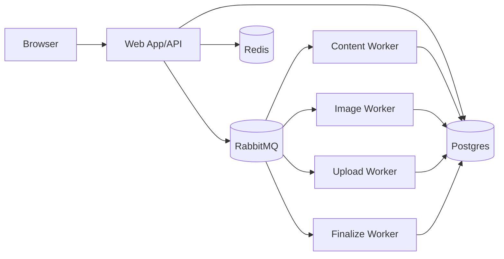

# AI Presentation Platform

AI deck generator + editor built with TanStack Start, Prisma/Postgres, RabbitMQ workers, Redis SSE, Gemini, and ImageKit.

## Project Layout

This repository is organized for local development and production deployment:

- `src/`: web app routes, APIs, editor UI, and server logic.
- `workers/`: async consumers (content, image generation, upload, finalize).
- `prisma/`: schema and generated client setup.
- `scripts/`: operational scripts (backup/restore).
- `docker-compose.yml`: local development stack.
- `docker-compose.prod.yml`: production stack (Hostinger VPS).
- `Dockerfile.web` and `Dockerfile.worker`: production images.
- `Caddyfile`: reverse proxy + HTTPS for production domain.
- `.env.development.example`, `.env.staging.example`, `.env.production.example`: environment templates.

## Run Locally (Recommended)

1. Create local env file:
   - `cp .env.development.example .env`
2. Fill required keys in `.env`:
   - `AUTH_SECRET`
   - `GEMINI_API_KEY`
   - `IMAGEKIT_PUBLIC_KEY`
   - `IMAGEKIT_PRIVATE_KEY`
   - `IMAGEKIT_URL_ENDPOINT`
3. Install dependencies:
   - `npm install`
4. Start the full local stack (web + db + queue + workers):
   - `docker compose up --build -d`
5. Check services:
   - `docker ps`
   - Open app at `http://localhost:3000`
6. Optional verification:
   - `npm run db:generate`
   - `npm run build`
   - `npm run lint`

Notes:

- Local `migrate` service runs `db:push --accept-data-loss` to avoid blocking startup in iterative dev environments.
- Worker replicas default to all queues (`content,image,upload,finalize`) unless `WORKER_CLASSES` is explicitly set.

## Local Troubleshooting

### Workers not running

Run:

```bash
docker compose up -d worker
docker compose logs worker --tail 100
docker ps
```

Healthy workers should log: `Starting worker consumers` and `All worker consumers are running`.

### Slides stuck in `Queued/Generating`

- Ensure worker containers are `Up`.
- Ensure RabbitMQ is `Up` (`http://localhost:15672`, guest/guest by default).
- Check worker logs for queue errors.

### Images not appearing

- Confirm `IMAGEKIT_*` vars are present in `.env`.
- Confirm `GEMINI_API_KEY` is valid.
- Re-run the image queue by regenerating slide image from editor.
- Check worker logs for `SLIDE_IMAGE_GENERATE` / `SLIDE_IMAGE_UPLOAD` failures.

## Architecture



## Production Deploy (Hostinger VPS)

1. Create prod env:
   - `cp .env.production.example .env.production`
2. Start infra:
   - `docker compose -f docker-compose.prod.yml --env-file .env.production up -d postgres rabbitmq redis`
3. Run one-shot migration:
   - `docker compose -f docker-compose.prod.yml --env-file .env.production --profile ops run --rm migrate`
4. Start app + workers + proxy:
   - `docker compose -f docker-compose.prod.yml --env-file .env.production up -d web worker-content worker-image worker-finalize caddy`

## Health, Metrics, and Ops

- System health: `GET /api/health/system`
- Worker health:
  - `GET /api/health/workers/`
  - `GET /api/health/workers/content`
  - `GET /api/health/workers/image`
  - `GET /api/health/workers/upload`
  - `GET /api/health/workers/finalize`
- Metrics: `GET /api/metrics` (`Authorization: Bearer <METRICS_TOKEN>` if configured)
- Backups:
  - `scripts/backup-postgres.sh`
  - `scripts/restore-postgres.sh`
  - cron template: `scripts/pg-backup.cron`

## Useful Commands

- `npm run dev`
- `npm run build`
- `npm run start`
- `npm run lint`
- `npm run test`
- `npm run db:generate`
- `npm run db:migrate`
- `npm run db:migrate:deploy`
