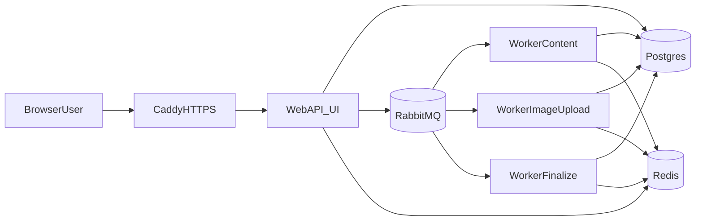

# AI Presentation Platform

Production-ready AI deck generator and editor built on TanStack Start, RabbitMQ workers, Postgres, Redis, and ImageKit.

## Architecture



## Quick Start (Development)

1. Copy environment defaults:
   - `cp .env.development.example .env`
2. Install dependencies:
   - `npm install`
3. Start stack:
   - `docker compose up --build`
4. Run one-off Prisma generate/build checks:
   - `npm run db:generate`
   - `npm run build`

## Production Deploy (Hostinger VPS)

### 1) Environment

1. Copy production env template:
   - `cp .env.production.example .env.production`
2. Fill real secrets (OAuth, Gemini/ImageKit, auth secret, Sentry, backup remote target).

### 2) Build and start infra/app

```bash
docker compose -f docker-compose.prod.yml up -d postgres rabbitmq redis
```

### 3) Run migrations once (never on web boot)

```bash
docker compose -f docker-compose.prod.yml --profile ops run --rm migrate
```

### 4) Start web/workers/proxy

```bash
docker compose -f docker-compose.prod.yml up -d web worker-content worker-image worker-finalize caddy
```

## Health and Metrics

- Web system health: `GET /api/health/system`
- Worker aggregate health: `GET /api/health/workers/`
- Per worker class health:
  - `GET /api/health/workers/content`
  - `GET /api/health/workers/image`
  - `GET /api/health/workers/upload`
  - `GET /api/health/workers/finalize`
- Metrics endpoint: `GET /api/metrics`
  - Protected with `METRICS_TOKEN` if configured (`Authorization: Bearer <token>`).

## Observability

- Structured logs: JSON via `pino` for web + workers.
- Error tracking: Sentry via `SENTRY_DSN`, `SENTRY_ENVIRONMENT`, `SENTRY_RELEASE`.
- Log rotation: handled at container/runtime level (Docker json-file limits or host logrotate). Configure this on VPS.

## Backups and Restore

### Nightly backup job

- Script: `scripts/backup-postgres.sh`
- Cron template: `scripts/pg-backup.cron`
- Supports local retention + optional remote upload via `scp` (`BACKUP_REMOTE_TARGET`).

Example host cron:

```bash
chmod +x scripts/backup-postgres.sh scripts/restore-postgres.sh
crontab scripts/pg-backup.cron
```

### Restore

```bash
POSTGRES_PASSWORD='***' scripts/restore-postgres.sh /path/to/aippt_YYYYMMDDTHHMMSSZ.sql.gz
```

## Runbook

### Restart workers

```bash
docker compose -f docker-compose.prod.yml restart worker-content worker-image worker-finalize
```

### Drain queue safely before maintenance

1. Stop web publishers first:
   - `docker compose -f docker-compose.prod.yml stop web`
2. Keep workers running until queue depths reach 0 (`/api/metrics`).
3. Stop workers after drain:
   - `docker compose -f docker-compose.prod.yml stop worker-content worker-image worker-finalize`

### Replay DLQ

1. Inspect DLQ depth in `/api/metrics` (`*.dlq` queues).
2. Move messages from DLQ back to primary queue from RabbitMQ management UI/API.
3. Start corresponding workers and monitor `generation_jobs_total` and logs.
4. Ensure idempotency keys are preserved and job rows are not manually duplicated.

## Environment Separation

- Development: `.env.development.example`
- Staging: `.env.staging.example`
- Production: `.env.production.example`
- Legacy/base reference: `.env.example`

## Scripts

- `npm run dev`
- `npm run build`
- `npm run start`
- `npm run db:generate`
- `npm run db:migrate`
- `npm run db:migrate:deploy`
- `npm run test`
- `npm run lint`

## Deliverables Checklist (Pass/Gap Matrix)

Infra-only phase status:

- Google OAuth works alongside GitHub with account linking — **Pass (existing, not changed in Phase 9)**
- Home page with prompt/options/history — **Pass (existing)**
- Editable persisted outline review — **Pass (existing)**
- RabbitMQ parallel per-slide workers — **Pass (existing)**
- `/presentation/:id` live progress navigation-safe — **Pass (existing)**
- 4 templates hot-swappable — **Pass (existing)**
- Full editor controls — **Pass (existing baseline)**
- Slideshow + export to PPTX/PDF/PNG + share link — **Gap (PDF/PNG export still outside this infra-only phase)**
- ImageKit integration for images — **Pass (existing)**
- Dockerized Hostinger-ready deployment + HTTPS on `codexaa.io` — **Pass (implemented in this phase)**
- Sentry + structured logs + health checks + graceful shutdown + DLQ ops — **Pass (implemented/documented in this phase)**
- Clean modern accessible dark-mode UI — **Pass (existing baseline)**
